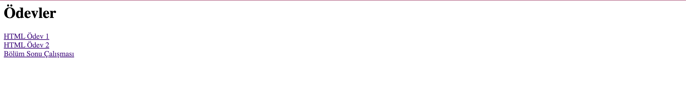
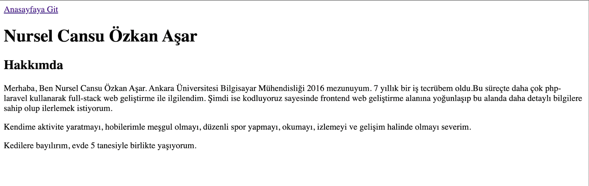
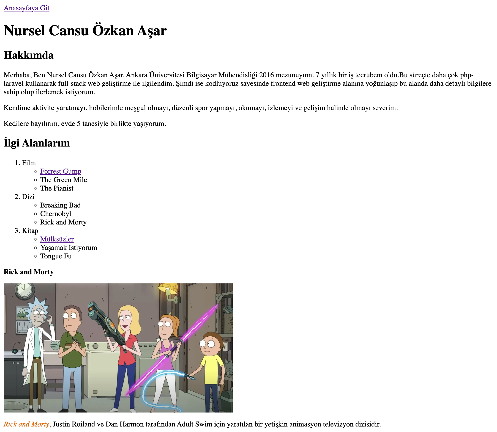
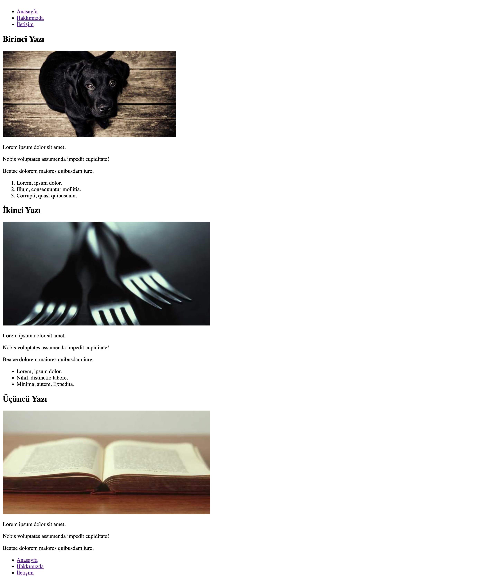
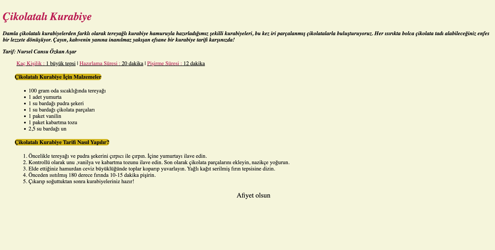
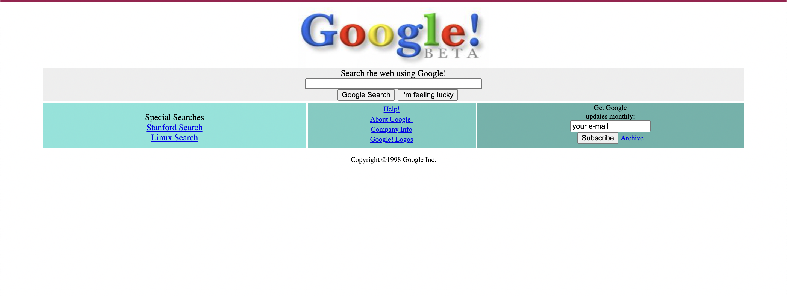
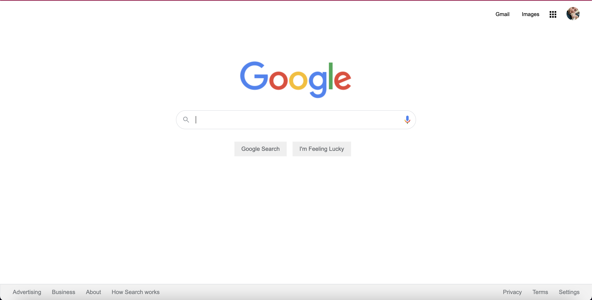
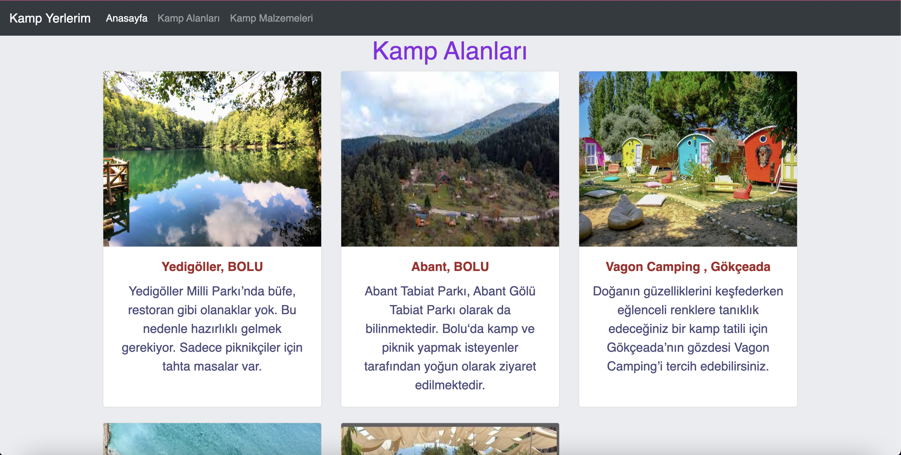

## Ödevler

## Kodluyoruz Frontend Eğitimi HTML Ödev 1

## Kodluyoruz Frontend Eğitimi HTML Ödev 2

## Kodluyoruz Frontend Eğitimi HTML Bölüm Sonu Çalışması

## Kodluyoruz Frontend Eğitimi HTML Ödev 3

## Kodluyoruz Frontend Eğitimi CSS Ödev 1

## Kodluyoruz Frontend Eğitimi CSS Ödev 2

## Kodluyoruz Frontend Eğitimi CSS Ödev 3

## Kodluyoruz Frontend Eğitimi Bootstrap Ödev 1

## Kodluyoruz Frontend Eğitimi Bootstrap Ödev 2
